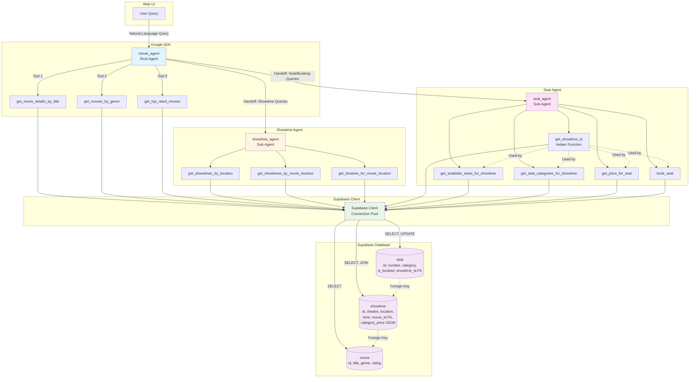
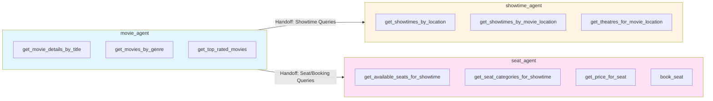
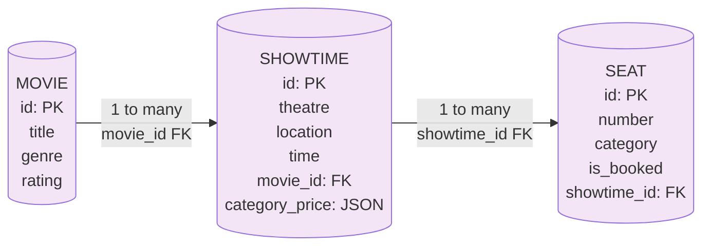
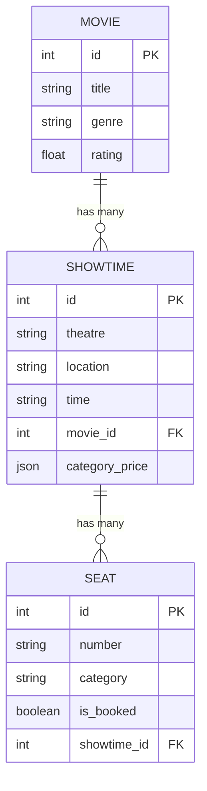
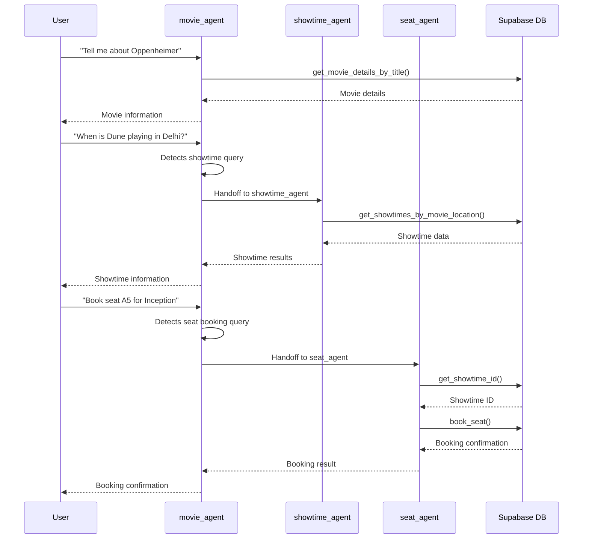

# BookMyShow AI Agent System - Architecture Diagram

## Simplified Agent Architecture

## Database Schema

## Agent Handoff Flow

## Component Details

### Agents
- **movie_agent**: Root agent that handles movie discovery and routes queries to sub-agents
- **showtime_agent**: Specialized agent for showtime and theatre information
- **seat_agent**: Specialized agent for seat availability, pricing, and booking

### Tools by Agent

**Movie Agent:**
- `get_movie_details_by_title`: Fetch movie by title
- `get_movies_by_genre`: Fetch movies by genre
- `get_top_rated_movies`: Fetch top-rated movies (rating > 8.0)

**Showtime Agent:**
- `get_showtimes_by_location`: Get all showtimes in a location
- `get_showtimes_by_movie_location`: Get showtimes for specific movie and location
- `get_theatres_for_movie_location`: Get distinct theatres for movie and location

**Seat Agent:**
- `get_showtime_id`: Helper to resolve showtime ID from movie, theatre, location, time
- `get_available_seats_for_showtime`: Get available seats (optionally filtered by category)
- `get_seat_categories_for_showtime`: Get seat categories and prices
- `get_price_for_seat`: Get price for a specific seat
- `book_seat`: Book a specific seat

### Database Tables

**movie**
- Primary key: `id`
- Fields: `title`, `genre`, `rating`

**showtime**
- Primary key: `id`
- Foreign key: `movie_id` → `movie.id`
- Fields: `theatre`, `location`, `time`, `category_price` (JSON with category-price mappings)

**seat**
- Primary key: `id`
- Foreign key: `showtime_id` → `showtime.id`
- Fields: `number`, `category`, `is_booked`

